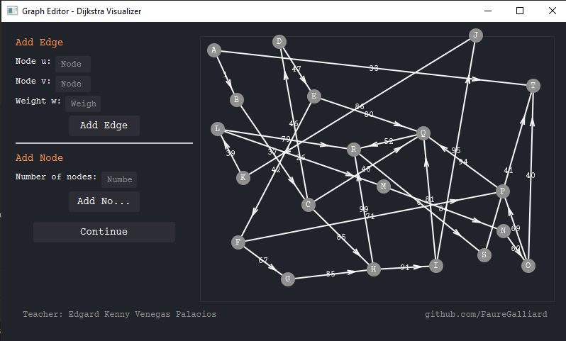
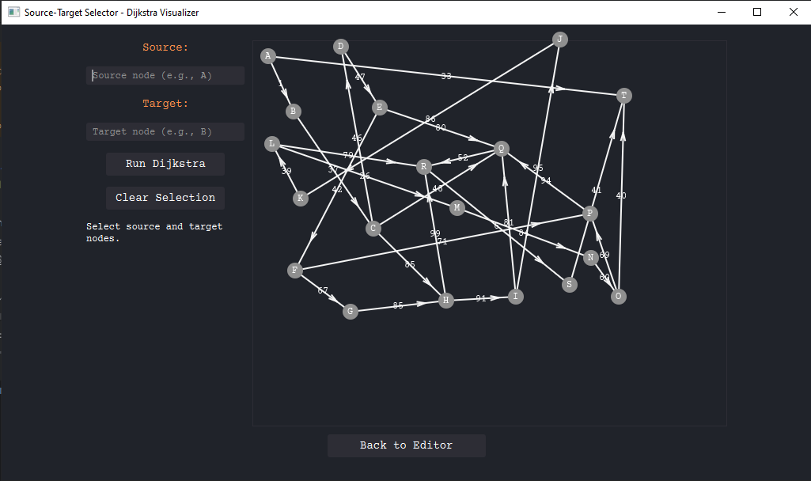
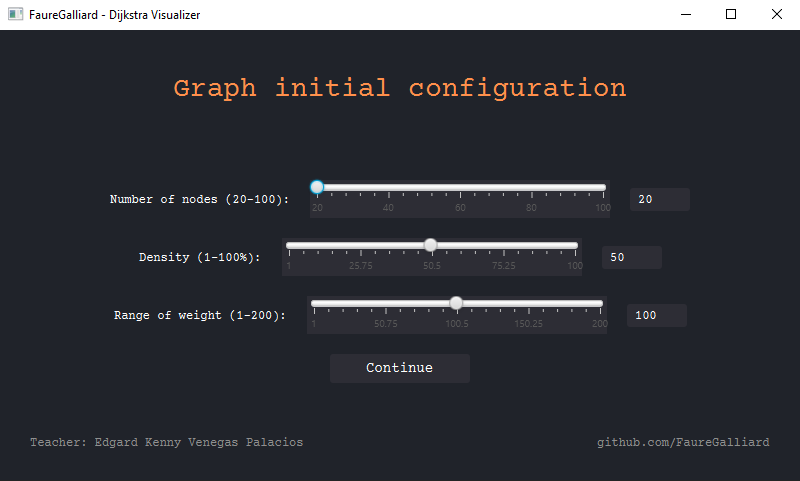

# Dijkstra Visualizer

An interactive JavaFX application to visualize **Dijkstra's shortest path algorithm** on graphs.  
The tool allows you to build, edit, and explore weighted graphs while observing how the algorithm finds the shortest path between two nodes.

---

## ✨ Features
- Add and remove **nodes** and **edges**.
- Set **number of nodes**, **graph density**, and **edge weight ranges**.
- **Move nodes** freely to rearrange the layout for better visualization.
- Select **start** and **end** nodes to run Dijkstra's algorithm.
- Highlight and visualize the **shortest path** found.
- Basic UI utilities for graph editing and visualization.

---

## 🛠️ Built With
- **Java 21**
- **JavaFX 21**
- **IntelliJ IDEA** (development environment)

---

## 🚀 Getting Started

### Prerequisites
- [Java JDK 21+](https://adoptium.net/)
- [JavaFX SDK 21](https://openjfx.io/) (download and extract)

### Run Locally
1. Clone the repository:
   ```bash
   git clone https://github.com/your-username/dijkstra-visualizer.git
   cd dijkstra-visualizer
2. Open in IntelliJ IDEA (or your preferred IDE).
3. Configure JavaFX:
   - Add VM options:
     ```bash
      --module-path "path/to/javafx-sdk-21/lib" --add-modules javafx.controls,javafx.fxml
4. Run **Main** class

## 📂 Project Structure
   
    src/
    ├── main/
    │   ├── java/com/fauregalliard/dijsktravisualizer/
    │   │    ├── model/        # Graph model (Node, Edge, Graph)
    │   │    ├── ui/           # JavaFX scenes and UI utilities
    │   │    └── util/         # Helper utilities
    │   └── resources/
    │        ├── css/          # Stylesheets
    │        └── images/       # Assets (icons, etc.)
    └── test/

## 📸 Screenshots
- Edit graph

- Select Source and target

- Create initial graph
